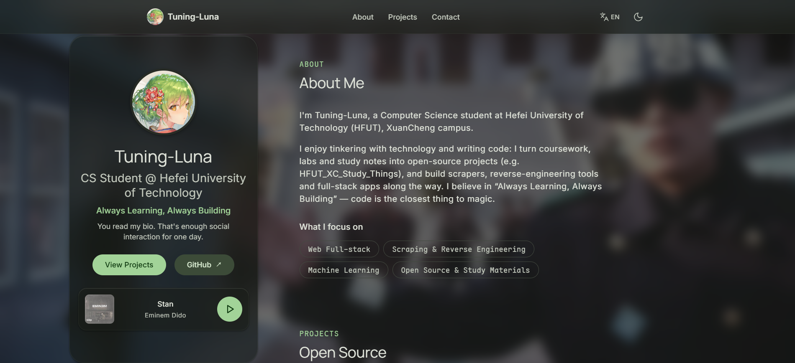

  

<h1 align="center">Tuning-Luna's homepage</h1>

 built with **React + Vite + TypeScript**, featuring **Material Design 3** and **Glassmorphism UI**.

Live URL: <https://tuning-luna.github.io/>

## Tech Stack

- [React](https://react.dev/)
- [Vite](https://vite.dev/)
- [TypeScript](https://www.typescriptlang.org/)
- [react-i18next](https://react.i18next.com/) — Bilingual support (Chinese & English)
- [@material/material-color-utilities](https://github.com/material-foundation/material-color-utilities) (used only during development to generate color tokens)
- GitHub Pages + GitHub Actions for automated build and deployment

## Deployment

After pushing to the `main` branch, GitHub Actions automatically runs `lint → build → deploy` to GitHub Pages.
See configuration in `.github/workflows/deploy.yml`, following the [Vite official deployment guide](https://vite.dev/guide/static-deploy).
Since the repository is named `<username>.github.io`, the site is deployed as a user site at the root path, with `base: '/'` set in `vite.config.ts`.